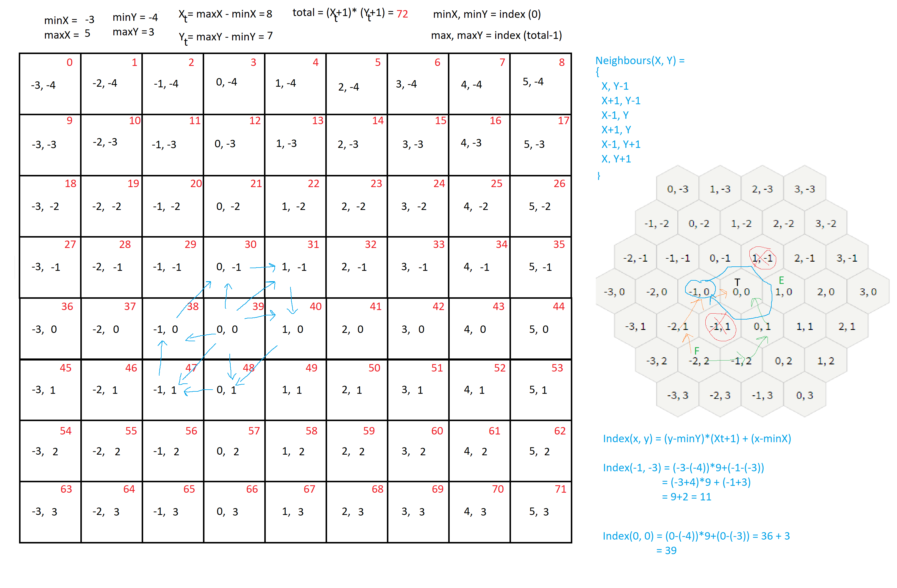

# HexGridTraversal
Distance based Hex Grid Traversal
Note: Missing boundry checks. 

Works by creating an array of cells for hex grid. 
- in the grid assign a destination cell. 
- add distances in each cell to target cell. 
- Starting from Souce 
  -  push source in stack
    - while stack is not empty: 
      -pop stack -> get cell 
      -choose neighbours with minimum distance and push them in stack (can be more than 1)
      -record move
      -keep on doing until dest is not reached
      -on destination check if it is minimum number of moves 
      -if minimum number of moves already recorded then no need to move beyong minimum number of moves on each path
    -return path recorded in this way.
Some useful info is shown in picture. 

